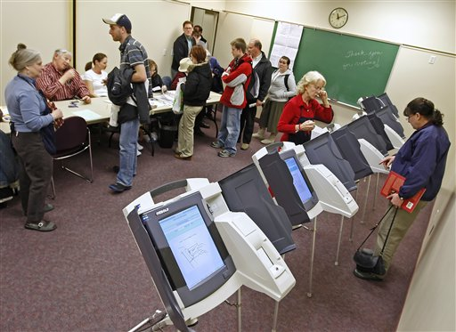

<!-- $theme: gaia -->
<!-- $size: 16:9 -->

## Voto telemático y voto electrónico
###### Criptografía y Computación

*Marco Manuel Fernandez Pranno*
*Granada, 2017.*

---

## Indice

* Características de un sistema de voto
* Mejoras respecto al sistema convencional
* Precauciones, consideraciones y peligros
* Situación actual
* Posibles mejoras
* Futuro: Blockchain al rescate (?)
* Conclusión
* Bibliografía

---

#### 1. Características de un sistema de voto

 - __Precisión__: Establecer la intención de cada votante y representarlo en un resultado final. No siendo posible la alteracion de los votos por una entidad ajena.
 
 - __Anonimato__: Imposible identificar al individuo votante durante el proceso. 
 - __Escalabilidad__: Capaz de manejar cargas de trabajo muy grandes.  
 (Ej: 372 millones en India, 115 millones en Brasil)
 - __Velocidad__: Presentar un resultado final con presteza (pocas).

---

#### 2. Mejoras respecto al sistema convencional

- En ciertos sistemas, mas conveniente para los votantes ya que no hay necesidad de traslado.  
- Mas eficientes y menos recursos (tanto humanos como materiales)
- Ofrecen enormes ventajas frente al uso de distintos idiomas o votantes con discapacidad.
- Tasa de error menor frente a sistemas convencionales, el error humano supera el error de un sistema electronico.
- Mayor velocidad en el recuento.
- Con un diseño adecuado ofrece posibilidades de un análisis forense fiable para validar los resultados.

---

#### 3. Precauciones, consideraciones y peligros

- Los errores no son uniformes, pueden favorecer/perjudicar a una opcion particular.
- Pueden alterar las tasas de voto debido a la barrera de la tecnologica. 
- Un error de software al ser explotado puede suponer la alteracion de todo el sistema al completo.
- Extremadamente dificiles de testear en un ambiente real.
- Amenazas: Individuos, crimen organizado u agencias de inteligencia gubernamentales.

---

#### 4. Situación actual

__Direct Record Electronic (DRE)__: Sistema mas extendido, una maquina fisica con interfaz de botones o tactil que ofrece las distintas opciones de voto.

 

---

#### DRE
 
- Informacion almacenada en una memoria extraible, transportada a un lugar seguro para el recuento
- Verificacion del voto con un impreso en papel, almacenado para casos de segundos recuentos y como medida de seguridad
- La mayoria ofrecen un feedback inmediato para verificar el voto correcto
- Generalmente software privativo
- La interfaz tactil da lugar a errores en el uso
- Suponen una inversion considerable, su mantenimiento y actualizacion no siempre es el optimo

---

#### Ejemplo: Sequoia AVC Edge

__Proceso de voto__:
1. Tarjeta electronica.
2. Seleccion de lenguaje y opciones.
3. Reconocimiento y almacenamiento del voto.
4. Reinicio de la tarjeta para asegurar solo un voto por votante.
5. Opcional: Se imprime un comprobante de la operacion.

---

#### Ejemplo: Sequoia AVC Edge

__Vulnerabilidades:__

- Criptografia facil de evadir
- Algoritmos de cifrado mal implementados
- Uso de algoritmos debiles con vulnerabilidades conocidas
- Todas las llaves de cifrado hard-codeadas en el sistema, identicas en todos los sistemas.  
  Lo que implica que alguien con acceso temporal a una maquina puede comprometer todos los sistemas de voto del pais.

---

#### 5. Posibles mejoras

- __Simplicidad__: Diseño sencillo y testeado
- __Uniformidad__: Sistema estandarizado en todos los puestos de voto
- __Verificabilidad__: Impresion de un certificado del voto, con validez para recuento y analisis posterior
- __Transparencia__: Codigo de dominio publico, sujeto al escrutinio publico. Permitiendo una mejora y un analisis continuo del sistema

---

#### 6. Futuro: Blockchain al rescate (?)

__PRO__:

- Sistema descentralizado
- Dificil modificacion de los datos introducidos

__CON__:

- Votos almacenados permanentemente en la blockchain, de ser posible identificar a los votantes estos perderian el valor fundamental del voto anonimo/privado y los podria poner en grave peligro
- El resto de aspectos del sistema sigue siendo igual de vulnerable

---

#### 7. Conclusión

---

#### 8. Bibliografía

- [Bruce Schneier: The Problem with Electronic Voting Machines](https://www.schneier.com/blog/archives/2004/11/the_problem_wit.html)

- [Bruce Schneier: American Elections Will Be Hacked](https://youtu.be/WU-Ibf-Fwj0)

- [Bruce Schneier: Why is it so hard to run an honest election?](https://www.schneier.com/blog/archives/2004/10/getting_out_the.html)

- [Ars Technica: Meet the e-voting machine so easy to hack, it will take your breath away](https://arstechnica.com/tech-policy/2015/04/meet-the-e-voting-machine-so-easy-to-hack-it-will-take-your-breath-away/)

- [Computerphile: Why Electronic Voting is a BAD Idea](https://www.youtube.com/watch?v=w3_0x6oaDmI)

- [E-Voting Machine: Sequoia AVC Edge](https://www.verifiedvoting.org/resources/voting-equipment/sequoia/avc-edge/)

---

#### 8. Bibliografía

- [Blockchain Technology in Online Voting
](https://followmyvote.com/online-voting-technology/blockchain-technology/)

- [Will Blockchain-Based Election Systems Make E-Voting Possible?](http://www.govtech.com/security/Will-Blockchain-Based-Election-Systems-Make-E-Voting-Possible.html)

- [Elon Musk: Mars government](https://www.recode.net/2016/6/3/11852148/elon-musk-mars-government-direct-democracy)

- [Patent: Electric voting-machine (1897)](https://www.google.com/patents/US616174)

- [Wiki: Electronic voting](https://en.wikipedia.org/wiki/Electronic_voting)

- [Wiki: Certification of voting machines](https://en.wikipedia.org/wiki/Certification_of_voting_machines)

- [Wiki: E-Democracy](https://en.wikipedia.org/wiki/E-democracy)

- [Wiki: DRE voting machine](https://en.wikipedia.org/wiki/DRE_voting_machine)

--- 

#### 8. Bibliografía

- [Block The Vote: Could Blockchain Technology Cybersecure Elections?](https://www.forbes.com/sites/realspin/2016/08/30/block-the-vote-could-blockchain-technology-cybersecure-elections/#3bcff0b32ab3)

- [Can the blockchain make electronic voting more secure?
](https://www.quora.com/Can-the-blockchain-make-electronic-voting-more-secure)