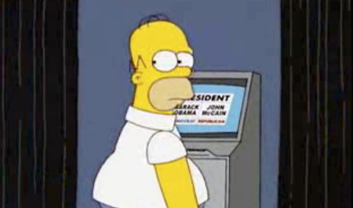

<!-- $theme: gaia -->
<!-- $size: 16:9 -->

## Voto telemático y voto electrónico
###### Criptografía y Computación

*Marco Manuel Fernandez Pranno*
*Granada, 2017.*

---

## Indice

* Mejoras respecto al voto convencional
* Precauciones, consideraciones y peligros
* Sistemas de voto electrónico/telemático actuales
* Posibles mejoras
* Conclusión
* Bibliografía

---

#### 1. Mejoras respecto al voto convencional

---

#### Bibliografía

- [Bruce Schneier: The Problem with Electronic Voting Machines](https://www.schneier.com/blog/archives/2004/11/the_problem_wit.html)

- [Bruce Schneier: American Elections Will Be Hacked](https://youtu.be/WU-Ibf-Fwj0)

- [Bruce Schneier: Why is it so hard to run an honest election?](https://www.schneier.com/blog/archives/2004/10/getting_out_the.html)

- [Computerphile: Why Electronic Voting is a BAD Idea](https://www.youtube.com/watch?v=w3_0x6oaDmI)
- [Elon Musk: Mars government](https://www.recode.net/2016/6/3/11852148/elon-musk-mars-government-direct-democracy)

- [Wiki: Electronic voting](https://en.wikipedia.org/wiki/Electronic_voting)

- [Wiki: Certification of voting machines](https://en.wikipedia.org/wiki/Certification_of_voting_machines)

- [Wiki: E-Democracy](https://en.wikipedia.org/wiki/E-democracy)
